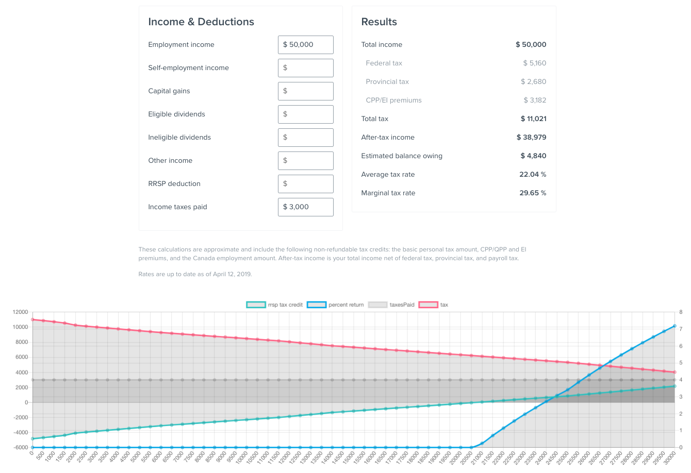

## RRSP Contribution optimizer

This is a quick tool I hacked together to help me see how much refund I would get on my tax returns at different contribution amounts. This is meant for Canadians in the 2019 tax year.

This calculator was forked from simpletax.ca/calculator. I only added the graph for the RRSP contributions, calculated using their taxCalc prototype. The graph was rendered using Chart.js

